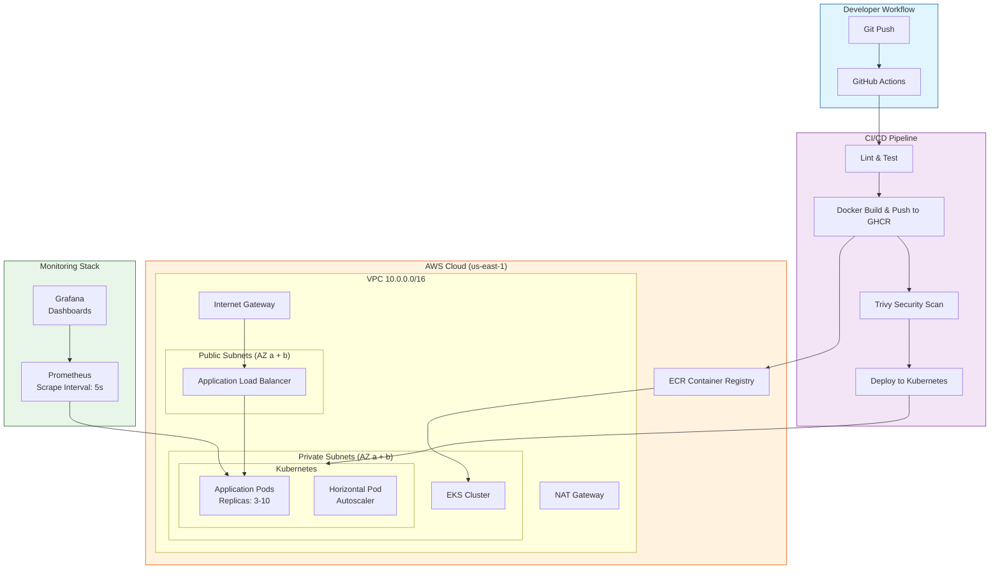

# DevOps Portfolio Project

<div align="center">

[](https://github.com/karthikk022/devops-portfolio-project/actions/workflows/ci-cd.yml)
[](https://github.com/karthikk022/devops-portfolio-project/actions/workflows/ci-cd.yml)
[](https://github.com/karthikk022/devops-portfolio-project/actions/workflows/ci-cd.yml)
[](https://www.docker.com/)
[](https://kubernetes.io/)
[](https://www.terraform.io/)
[](https://aws.amazon.com/)
[](https://prometheus.io/)
[](https://grafana.com/)
[](https://nodejs.org/)
[](LICENSE)

**A comprehensive DevOps pipeline demonstrating CI/CD automation, container orchestration, infrastructure-as-code, and monitoring — deployed on AWS EKS.**

> **Note:** Badges will show live status after the first workflow run on the `main` branch.

[Features](#features) • [Architecture](#architecture) • [Getting Started](#getting-started) • [Project Structure](#project-structure) • [API](#api-endpoints) • [Infrastructure](#infrastructure) • [Monitoring](#monitoring)

</div>

---

## Features

| Area | Capabilities |
|------|-------------|
| **CI/CD** | GitHub Actions with multi-stage pipeline: lint → test → build → security scan → deploy |
| **Containerization** | Multi-stage Docker builds with security hardening (non-root user, read-only filesystem) |
| **Orchestration** | Kubernetes with HPA auto-scaling, rolling updates, resource limits, and ingress with TLS |
| **Infrastructure-as-Code** | Terraform provisioning of VPC, subnets, NAT Gateway, EKS cluster, and node groups |
| **Security** | Trivy container vulnerability scanning, Pod Security Context, non-root execution |
| **Observability** | Prometheus metrics collection and Grafana dashboards with custom application metrics |
| **High Availability** | Multi-AZ deployment, auto-scaling (3–10 pods), health checks with liveness/readiness probes |

---

## Architecture



---

## Tech Stack

| Category | Technologies |
|----------|-------------|
| **Application** | Node.js (v18), Express.js |
| **Containerization** | Docker, Docker Compose, GitHub Container Registry (GHCR) |
| **Orchestration** | Kubernetes v1.29, HorizontalPodAutoscaler, Ingress NGINX |
| **Infrastructure** | Terraform ≥1.3.0, AWS (EKS, VPC, EC2, IAM, S3, DynamoDB) |
| **CI/CD** | GitHub Actions, Trivy Security Scanner |
| **Monitoring** | Prometheus, Grafana, prom-client (custom Node.js metrics) |
| **Testing** | Jest, Supertest, ESLint |

---

## Getting Started

### Prerequisites

- [Node.js](https://nodejs.org/) v18+
- [Docker](https://www.docker.com/) & [Docker Compose](https://docs.docker.com/compose/)
- [kubectl](https://kubernetes.io/docs/tasks/tools/) configured for your cluster
- [Terraform](https://developer.hashicorp.com/terraform/downloads) ≥1.3.0
- [AWS CLI](https://aws.amazon.com/cli/) configured with appropriate credentials
- **For Terraform backend:** Create S3 bucket `devops-portfolio-terraform-state` in your AWS account

### Quick Start

#### 1. Local Development

```bash
# Install dependencies and run tests
cd src
npm install
npm test

# Run the application locally
npm start
```

The API will be available at `http://localhost:3000`.

#### 2. Docker Compose (Local Stack)

```bash
# Start all services (app + Prometheus + Grafana)
docker compose up -d

# Services:
# - App:      http://localhost:3000
# - Grafana:  http://localhost:3030 (admin/admin)
# - Prometheus: http://localhost:9090

# Stop everything
docker compose down
```

#### 3. Kubernetes Deployment

> **Note:** Update the ingress domain from `app.example.com` to your real domain in `k8s/deployment.yml` before deploying to production.

```bash
# Deploy to your cluster
make deploy-k8s

# Or manually:
kubectl apply -f k8s/namespace.yml
kubectl apply -f k8s/configmap.yml
kubectl apply -f k8s/deployment.yml
```

#### 4. Infrastructure Provisioning (AWS EKS)

> **Prerequisite:** Create the S3 bucket `devops-portfolio-terraform-state` for the Terraform backend before running `terraform init`.

```bash
cd terraform

# Initialize and review
export AWS_REGION=us-east-1
terraform init
terraform plan

# Apply infrastructure
terraform apply -auto-approve

# Configure kubectl
aws eks update-kubeconfig --region us-east-1 --name devops-portfolio-cluster

# Destroy when done
terraform destroy -auto-approve
```

---

## Project Structure

```
devops-portfolio-project/
├── .github/
│   └── workflows/
│       └── ci-cd.yml              # CI/CD pipeline (5 stages)
├── k8s/                          # Kubernetes manifests
│   ├── namespace.yml              # Namespaces: production, staging, monitoring
│   ├── configmap.yml              # App ConfigMap + Secrets
│   └── deployment.yml            # Deployment, Service, Ingress, HPA
├── monitoring/                   # Observability stack
│   ├── prometheus.yml              # Prometheus scrape config
│   └── grafana-dashboard.json     # Pre-configured Grafana dashboard
├── terraform/                    # Infrastructure-as-Code
│   ├── main.tf                    # Provider & VPC setup
│   ├── networking.tf              # Subnets, routes, NAT Gateway
│   ├── eks.tf                     # EKS cluster & node group
│   ├── variables.tf              # Configurable variables
│   └── outputs.tf                 # Terraform outputs
├── src/                          # Application source code
│   ├── app.js                    # Express.js API (health, users, metrics)
│   ├── app.test.js               # Jest + Supertest test suite
│   ├── package.json              # Node.js depen
